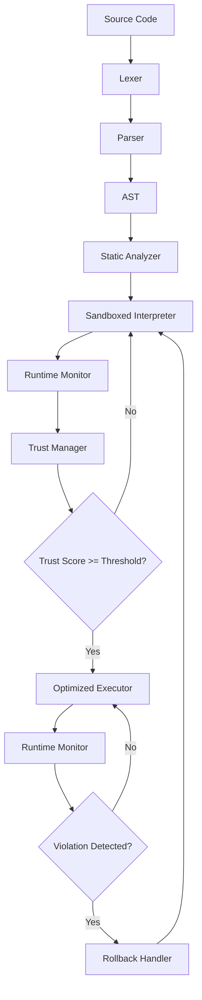

# Design Document: AEGIS (Adaptive Execution Guarded Interpreter System)

## Overview

AEGIS implements a security-first execution model where all code begins in a sandboxed interpreter and earns the right to optimized execution through demonstrated safe behavior. The system uses runtime monitoring to build trust profiles and can instantly rollback to secure interpretation when violations occur.

The architecture follows a traditional compiler pipeline (lexer → parser → AST) but diverges at execution with a dual-path approach: default sandboxed interpretation with conditional promotion to optimized execution based on trust scores. This design ensures security is never compromised for performance gains.

## Architecture

The system consists of eight core components organized in a pipeline architecture:



The architecture implements a feedback loop where execution behavior influences future execution paths. The Runtime Monitor serves as the critical security boundary, continuously validating execution against safety constraints.

## Components and Interfaces

### Lexer Module (`lexer/`)

**Purpose**: Converts source code into a stream of tokens for parsing.

**Key Classes**:
- `Token`: Represents individual lexical units (type, value, position)
- `Lexer`: Main tokenization engine
- `LexerError`: Exception class for lexical errors

**Interface**:
```python
class Lexer:
    def tokenize(self, source_code: str) -> List[Token]
    def _scan_token(self) -> Token
    def _is_identifier(self, char: str) -> bool
    def _is_digit(self, char: str) -> bool
```

**Token Types**: IDENTIFIER, INTEGER, ASSIGN, PLUS, MINUS, MULTIPLY, DIVIDE, PRINT, EOF, NEWLINE

### Parser Module (`parser/`)

**Purpose**: Builds Abstract Syntax Trees from token streams using recursive descent parsing.

**Key Classes**:
- `Parser`: Main parsing engine implementing recursive descent
- `ParseError`: Exception class for syntax errors

**Interface**:
```python
class Parser:
    def parse(self, tokens: List[Token]) -> AST
    def _parse_statement(self) -> ASTNode
    def _parse_assignment(self) -> AssignmentNode
    def _parse_expression(self) -> ExpressionNode
    def _parse_print(self) -> PrintNode
```

**Grammar Support**:
- Assignment: `identifier = expression`
- Arithmetic: `expression (+|-|*|/) expression` with precedence
- Print: `print identifier`

### AST Module (`ast/`)

**Purpose**: Defines Abstract Syntax Tree node types and provides tree manipulation utilities.

**Key Classes**:
- `ASTNode`: Base class for all AST nodes
- `AssignmentNode`: Variable assignment statements
- `BinaryOpNode`: Arithmetic operations
- `IdentifierNode`: Variable references
- `IntegerNode`: Integer literals
- `PrintNode`: Print statements
- `ASTPrettyPrinter`: Converts AST back to source code

**Interface**:
```python
class ASTNode:
    def accept(self, visitor: ASTVisitor) -> Any
    def get_children(self) -> List[ASTNode]

class ASTPrettyPrinter:
    def print_ast(self, node: ASTNode) -> str
```

### Static Security Analyzer (`interpreter/static_analyzer.py`)

**Purpose**: Performs compile-time security and safety checks on the AST.

**Key Classes**:
- `StaticAnalyzer`: Main analysis engine
- `AnalysisError`: Exception class for static analysis violations

**Interface**:
```python
class StaticAnalyzer:
    def analyze(self, ast: AST) -> AnalysisResult
    def _check_undefined_variables(self, node: ASTNode) -> List[str]
    def _check_arithmetic_safety(self, node: ASTNode) -> List[str]
    def _validate_expression(self, node: ASTNode) -> bool
```

**Analysis Checks**:
- Undefined variable detection
- Arithmetic overflow potential
- Expression well-formedness
- Variable definition before use

### Sandboxed Interpreter (`interpreter/`)

**Purpose**: Provides the default secure execution environment with complete isolation.

**Key Classes**:
- `SandboxedInterpreter`: Main interpreter engine
- `ExecutionContext`: Maintains variable state and execution environment
- `InterpreterError`: Exception class for runtime errors

**Interface**:
```python
class SandboxedInterpreter:
    def execute(self, ast: AST, context: ExecutionContext) -> ExecutionResult
    def _execute_assignment(self, node: AssignmentNode, context: ExecutionContext)
    def _execute_expression(self, node: ExpressionNode, context: ExecutionContext) -> int
    def _execute_print(self, node: PrintNode, context: ExecutionContext)
```

**Security Features**:
- Memory isolation per execution
- Arithmetic overflow protection
- No system call access
- Controlled variable scoping

### Runtime Monitor (`runtime/`)

**Purpose**: Tracks execution behavior and detects security violations in real-time.

**Key Classes**:
- `RuntimeMonitor`: Main monitoring engine
- `ExecutionMetrics`: Tracks performance and behavior statistics
- `ViolationDetector`: Identifies security violations
- `SecurityViolation`: Exception class for runtime violations

**Interface**:
```python
class RuntimeMonitor:
    def start_monitoring(self, execution_context: ExecutionContext)
    def record_operation(self, operation: str, details: Dict)
    def check_violations(self) -> List[SecurityViolation]
    def get_metrics(self) -> ExecutionMetrics
```

**Monitoring Capabilities**:
- Instruction count tracking
- Memory usage monitoring
- Operation type validation
- Execution time measurement
- Violation pattern detection

### Trust Manager (`trust/`)

**Purpose**: Maintains trust scores for code and makes optimization decisions.

**Key Classes**:
- `TrustManager`: Main trust management engine
- `TrustScore`: Represents trust level with history
- `TrustPolicy`: Configurable trust thresholds and rules

**Interface**:
```python
class TrustManager:
    def initialize_trust(self, code_hash: str) -> TrustScore
    def update_trust(self, code_hash: str, metrics: ExecutionMetrics)
    def reset_trust(self, code_hash: str, violation: SecurityViolation)
    def is_trusted(self, code_hash: str) -> bool
    def get_trust_score(self, code_hash: str) -> float
```

**Trust Calculation**:
- Base score: 0.0 (untrusted)
- Increment: +0.1 per safe execution
- Threshold: 1.0 for optimization eligibility
- Reset: 0.0 on any violation
- Persistence: Trust scores saved across sessions

### Optimized Executor (`compiler/`)

**Purpose**: Provides simulated compiled execution for trusted code with performance benefits.

**Key Classes**:
- `OptimizedExecutor`: Main optimized execution engine
- `CodeCache`: Stores compiled representations
- `OptimizationEngine`: Simulates compilation optimizations

**Interface**:
```python
class OptimizedExecutor:
    def compile_and_cache(self, ast: AST, code_hash: str)
    def execute_optimized(self, code_hash: str, context: ExecutionContext) -> ExecutionResult
    def clear_cache(self, code_hash: str)
    def _simulate_optimization(self, ast: AST) -> CompiledCode
```

**Optimization Simulation**:
- Constant folding simulation
- Dead code elimination markers
- Loop unrolling indicators
- Cached execution paths
- Performance timing simulation (2x faster than interpreter)

### Rollback Handler (`runtime/rollback.py`)

**Purpose**: Manages transitions from optimized execution back to sandboxed interpretation.

**Key Classes**:
- `RollbackHandler`: Main rollback coordination
- `RollbackEvent`: Represents rollback occurrences with details

**Interface**:
```python
class RollbackHandler:
    def trigger_rollback(self, violation: SecurityViolation, context: ExecutionContext)
    def restore_interpreter_state(self, context: ExecutionContext)
    def clear_optimized_cache(self, code_hash: str)
    def log_rollback_event(self, event: RollbackEvent)
```

## Data Models

### Core Data Structures

**Token**:
```python
@dataclass
class Token:
    type: TokenType
    value: str
    line: int
    column: int
```

**AST Nodes**:
```python
@dataclass
class AssignmentNode(ASTNode):
    identifier: str
    expression: ExpressionNode

@dataclass
class BinaryOpNode(ASTNode):
    left: ExpressionNode
    operator: str
    right: ExpressionNode

@dataclass
class IdentifierNode(ASTNode):
    name: str

@dataclass
class IntegerNode(ASTNode):
    value: int

@dataclass
class PrintNode(ASTNode):
    identifier: str
```

**Execution Context**:
```python
@dataclass
class ExecutionContext:
    variables: Dict[str, int]
    execution_mode: ExecutionMode
    code_hash: str
    output_buffer: List[str]
```

**Trust Score**:
```python
@dataclass
class TrustScore:
    code_hash: str
    current_score: float
    execution_count: int
    last_violation: Optional[datetime]
    history: List[TrustEvent]
```

**Execution Metrics**:
```python
@dataclass
class ExecutionMetrics:
    instruction_count: int
    memory_usage: int
    execution_time: float
    operations_performed: List[str]
    violations_detected: List[SecurityViolation]
```

### File System Organization

```
aegis/
├── lexer/
│   ├── __init__.py
│   ├── lexer.py          # Main lexer implementation
│   └── tokens.py         # Token definitions
├── parser/
│   ├── __init__.py
│   ├── parser.py         # Recursive descent parser
│   └── grammar.py        # Grammar definitions
├── ast/
│   ├── __init__.py
│   ├── nodes.py          # AST node classes
│   ├── visitor.py        # Visitor pattern implementation
│   └── pretty_printer.py # AST to source conversion
├── interpreter/
│   ├── __init__.py
│   ├── interpreter.py    # Sandboxed interpreter
│   ├── static_analyzer.py # Static security analysis
│   └── context.py        # Execution context management
├── trust/
│   ├── __init__.py
│   ├── trust_manager.py  # Trust score management
│   ├── trust_policy.py   # Trust policies and thresholds
│   └── persistence.py    # Trust score persistence
├── compiler/
│   ├── __init__.py
│   ├── optimizer.py      # Optimized executor
│   ├── cache.py          # Code caching system
│   └── simulation.py     # Compilation simulation
├── runtime/
│   ├── __init__.py
│   ├── monitor.py        # Runtime monitoring
│   ├── rollback.py       # Rollback handling
│   └── metrics.py        # Execution metrics
├── main.py               # Main entry point
└── README.md             # Project documentation
```

## Correctness Properties

*A property is a characteristic or behavior that should hold true across all valid executions of a system—essentially, a formal statement about what the system should do. Properties serve as the bridge between human-readable specifications and machine-verifiable correctness guarantees.*

### Property 1: Tokenization Round-Trip Consistency
*For any* valid source code in the AEGIS language, tokenizing the code and then reconstructing it from tokens should preserve the semantic meaning of the original program.
**Validates: Requirements 2.5**

### Property 2: Parsing Round-Trip Consistency  
*For any* valid token sequence, parsing into an AST and then pretty-printing back to source code should produce a semantically equivalent program.
**Validates: Requirements 3.5**

### Property 3: Arithmetic Expression Correctness
*For any* valid arithmetic expression with integer operands and operators (+, -, *, /), the interpreter should compute the mathematically correct result.
**Validates: Requirements 1.2, 5.3**

### Property 4: Variable Assignment Consistency
*For any* valid variable assignment statement, executing the assignment should update the variable's value in the execution context to match the assigned expression result.
**Validates: Requirements 1.1, 5.2**

### Property 5: Print Statement Output Correctness
*For any* valid print statement referencing a defined variable, the output should contain the current value of that variable.
**Validates: Requirements 1.3, 5.4**

### Property 6: Static Analysis Undefined Variable Detection
*For any* AST containing references to undefined variables, the static analyzer should detect and report all undefined variable usages before execution.
**Validates: Requirements 4.1, 4.4**

### Property 7: Execution State Isolation
*For any* two consecutive program executions, the second execution should not be affected by variable state from the first execution.
**Validates: Requirements 5.6**

### Property 8: Trust Score Lifecycle Management
*For any* code execution sequence, trust scores should start at zero, increment with safe executions, reset to zero on violations, and authorize optimization only when exceeding the threshold.
**Validates: Requirements 7.1, 7.2, 7.3, 7.4**

### Property 9: Execution Mode Transition Correctness
*For any* code with sufficient trust score, execution should transition to optimized mode, and any violation should immediately trigger rollback to interpreter mode.
**Validates: Requirements 8.2, 9.1, 9.2, 10.2, 10.3**

### Property 10: Semantic Equivalence Between Execution Modes
*For any* program executed in both interpreter and optimized modes, the results (variable states and output) should be identical.
**Validates: Requirements 8.4**

### Property 11: Runtime Monitoring Completeness
*For any* code execution, the runtime monitor should track all operations, record execution metrics, and detect any violations that occur.
**Validates: Requirements 6.1, 6.3, 6.4, 6.5**

### Property 12: Rollback State Consistency
*For any* rollback event triggered by a security violation, the system should maintain execution state consistency and clear all optimized caches.
**Validates: Requirements 9.3, 9.4, 9.5**

### Property 13: Error Message Descriptiveness
*For any* error condition (lexical, syntax, runtime, or security), the system should provide descriptive error messages with appropriate context and location information.
**Validates: Requirements 2.2, 3.2, 12.1, 12.2, 12.3, 12.4**

### Property 14: Pipeline Execution Completeness
*For any* valid source code input, the system should execute all pipeline stages (tokenize → parse → analyze → interpret → monitor → trust update) in the correct order.
**Validates: Requirements 10.1**

### Property 15: Console Output Visibility
*For any* system execution, the console output should display current execution mode, trust score changes, and any rollback events with violation details.
**Validates: Requirements 10.4, 10.5, 10.6**

## Error Handling

The AEGIS system implements comprehensive error handling across all components with clear error categorization and recovery strategies:

### Error Categories

**Lexical Errors**:
- Invalid characters in source code
- Malformed tokens
- Unexpected end of input
- Recovery: Report error with position, continue tokenization where possible

**Syntax Errors**:
- Invalid grammar constructs
- Missing operators or operands
- Malformed expressions
- Recovery: Report error with line/column, attempt error recovery for continued parsing

**Static Analysis Errors**:
- Undefined variable references
- Potential arithmetic overflow
- Malformed expressions
- Recovery: Report all errors found, prevent execution

**Runtime Errors**:
- Division by zero
- Integer overflow
- Variable access errors
- Recovery: Terminate execution safely, maintain system state

**Security Violations**:
- Unauthorized operations (detected by monitor)
- Trust threshold violations
- Sandbox boundary violations
- Recovery: Immediate rollback to interpreter, reset trust score

### Error Reporting Strategy

All errors include:
- Error type classification
- Descriptive message with context
- Location information (line/column for source errors)
- Suggested resolution where applicable
- Execution state information for runtime errors

### Error Recovery Mechanisms

- **Graceful Degradation**: System continues operation where possible
- **State Preservation**: Execution context maintained during error handling
- **Rollback Safety**: Security violations trigger safe rollback to interpreter
- **Audit Trail**: All errors logged with timestamps for analysis

## Testing Strategy

The AEGIS system employs a dual testing approach combining unit tests for specific scenarios and property-based tests for comprehensive validation:

### Unit Testing Approach

**Component-Level Tests**:
- Lexer: Test specific token recognition and error cases
- Parser: Test grammar constructs and syntax error handling  
- Static Analyzer: Test specific analysis rules and edge cases
- Interpreter: Test execution of specific language constructs
- Trust Manager: Test trust score calculations and persistence
- Runtime Monitor: Test metrics collection and violation detection

**Integration Tests**:
- End-to-end pipeline execution
- Component interaction validation
- Error propagation between components
- System state consistency across components

**Edge Case Coverage**:
- Empty source code
- Maximum integer values
- Complex nested expressions
- Boundary conditions for trust scores
- Rollback during various execution states

### Property-Based Testing Configuration

**Testing Framework**: Hypothesis (Python) for property-based testing
**Test Configuration**: Minimum 100 iterations per property test
**Test Tagging**: Each property test tagged with format: **Feature: aegis, Property {number}: {property_text}**

**Property Test Implementation**:
- Each correctness property implemented as a single property-based test
- Random input generation for comprehensive coverage
- Invariant validation across all generated inputs
- Shrinking support for minimal failing examples

**Generator Strategies**:
- Valid source code generation following grammar rules
- Invalid input generation for error handling tests
- Arithmetic expression generation with various complexities
- Variable name and integer value generation
- Trust score and execution metric generation

**Test Execution Requirements**:
- All property tests must pass before deployment
- Property tests run as part of continuous integration
- Performance benchmarks for interpreter vs optimized execution
- Security validation through violation simulation

### Testing Integration

**Continuous Validation**:
- Unit tests validate specific behaviors and edge cases
- Property tests validate universal correctness properties
- Integration tests validate component interactions
- Performance tests validate optimization effectiveness

**Coverage Requirements**:
- 100% coverage of all correctness properties
- Comprehensive error condition coverage
- All execution paths through security model
- Complete trust management lifecycle coverage